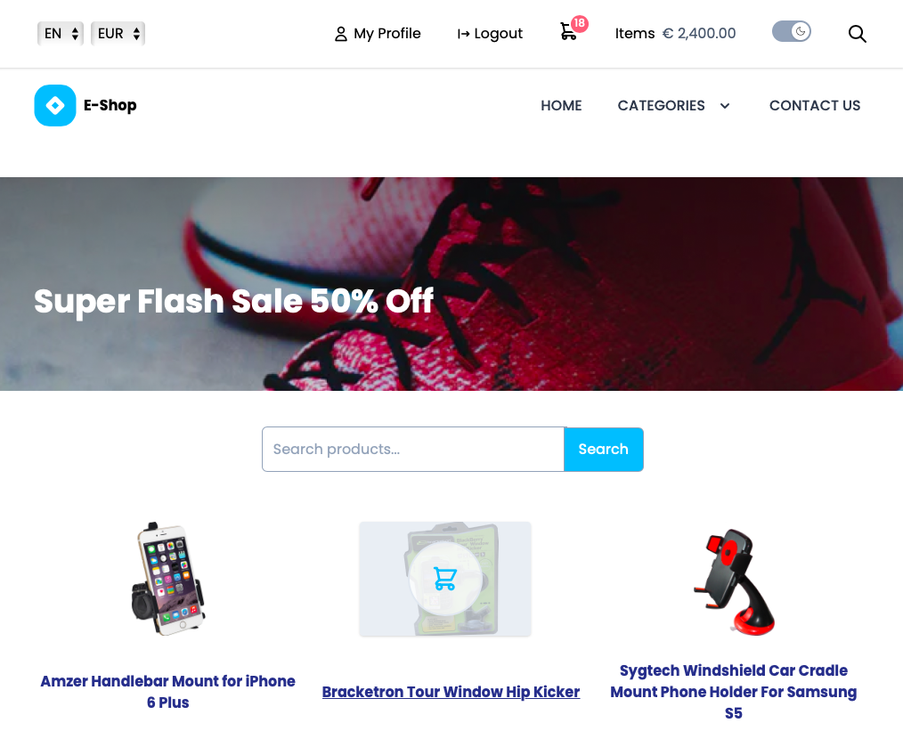
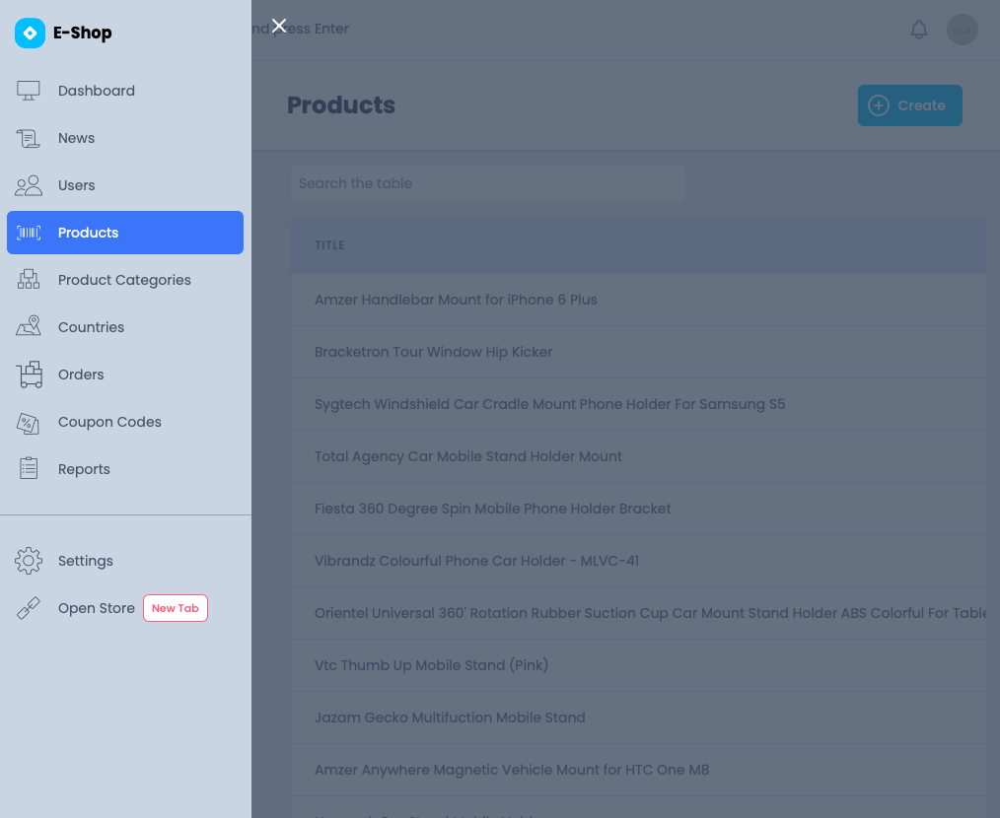

# E-Commerce Website (Project Cyan)





**Table of contents**

- [E-Commerce Website (Project Cyan)](#e-commerce-website-project-cyan)
  - [Technologies used](#technologies-used)
    - [Frontend](#frontend)
    - [Backend](#backend)
    - [Other](#other)
  - [Features List and implementation status](#features-list-and-implementation-status)
    - [Guest Features](#guest-features)
    - [User Features](#user-features)
    - [Admin Features](#admin-features)
  - [Models and Database structure](#models-and-database-structure)
  - [Installation](#installation)
  - [client](#client)
  - [server](#server)
  - [Testing](#testing)
  - [Usage](#usage)
    - [To boot up the server:](#to-boot-up-the-server)
    - [To boot up the client application:](#to-boot-up-the-client-application)
  - [Other info](#other-info)

## Technologies used

### Frontend

| Project             | Status                                         | Documentation                                     |
| ------------------- | ---------------------------------------------- | ------------------------------------------------- |
| [typescript]        | [![typescript-status]][typescript-package]     | https://www.typescriptlang.org/                   |
| [react]             | [![react-status]][react-package]               | https://reactjs.org/                              |
| [react-modal]       | [![react-modal-status]][react-modal-package]   |                                                   |
| [react-router]      | [![react-router-status]][react-router-package] | https://reactrouter.com/                          |
| [axios]             | [![axios-status]][axios-package]               |                                                   |
| [jsonwebtoken]      | [![jsonwebtoken-status]][jsonwebtoken-package] | https://github.com/auth0/node-jsonwebtoken#readme |
| [tailwindcss]       | [![tailwindcss-status]][tailwindcss-package]   | https://tailwindcss.com                           |
| [@headlessui/react] | [![headlessui-status]][headlessui-package]     | https://headlessui.dev/                           |

[typescript]: https://github.com/microsoft/TypeScript/
[typescript-status]: https://img.shields.io/npm/v/typescript.svg
[typescript-package]: https://www.npmjs.com/package/typescript
[react]: https://github.com/facebook/react
[react-status]: https://img.shields.io/npm/v/react.svg
[react-package]: https://www.npmjs.com/package/react
[react-modal]: https://github.com/reactjs/react-modal
[react-modal-status]: https://img.shields.io/npm/v/react-modal.svg
[react-modal-package]: https://www.npmjs.com/package/react-modal
[react-router]: https://github.com/facebook/react
[react-router-status]: https://img.shields.io/npm/v/react-router-dom.svg
[react-router-package]: https://www.npmjs.com/package/react-router-dom
[axios]: https://github.com/axios/axios
[axios-status]: https://img.shields.io/npm/v/axios.svg
[axios-package]: https://www.npmjs.com/package/axios
[tailwindcss]: github.com/tailwindlabs/tailwindcss
[tailwindcss-status]: https://img.shields.io/npm/v/tailwindcss.svg
[tailwindcss-package]: https://www.npmjs.com/package/tailwindcss
[jsonwebtoken]: github.com/auth0/node-jsonwebtoken
[jsonwebtoken-status]: https://img.shields.io/npm/v/jsonwebtoken.svg
[jsonwebtoken-package]: https://www.npmjs.com/package/jsonwebtoken
[@headlessui/react]: https://github.com/tailwindlabs/headlessui
[headlessui-status]: https://img.shields.io/npm/v/@headlessui/react.svg
[headlessui-package]: https://www.npmjs.com/package/@headlessui/react

Note: `autoprefixer` and `postcss` are also used together with `tailwindcss`

Other front-end DevDependencies:

- prettier
- eslint
- eslint-config-airbnb-typescript-prettier

### Backend

| Project              | Status                                                     | Documentation                                     |
| -------------------- | ---------------------------------------------------------- | ------------------------------------------------- |
| [typescript]         | [![typescript-status]][typescript-package]                 | https://www.typescriptlang.org/                   |
| [bcrypt]             | [![bcrypt-status]][bcrypt-package]                         | https://github.com/kelektiv/node.bcrypt.js#readme |
| [chai]               | [![chai-status]][chai-package]                             | chaijs.com                                        |
| [chai-http]          | [![chai-http-status]][chai-http-package]                   |                                                   |
| [cors]               | [![cors-status]][cors-package]                             |                                                   |
| [express]            | [![express-status]][express-package]                       | https://expressjs.com                             |
| [express-fileupload] | [![express-fileupload-status]][express-fileupload-package] |                                                   |
| [express-validator]  | [![express-validator-status]][express-validator-package]   | https://express-validator.github.io               |
| [jsonwebtoken]       | [![jsonwebtoken-status]][jsonwebtoken-package]             |                                                   |
| [mocha]              | [![mocha-status]][mocha-package]                           | https://mochajs.org                               |
| [nodemon]            | [![nodemon-status]][nodemon-package]                       | https://nodemon.io                                |
| [passport]           | [![passport-status]][passport-package]                     | https://passportjs.org                            |
| [passport-jwt]       | [![passport-jwt-status]][passport-jwt-package]             |                                                   |
| [pg]                 | [![pg-status]][pg-package]                                 |                                                   |
| [pg-copy-streams]    | [![pg-copy-streams-status]][pg-copy-streams-package]       |                                                   |
| [pluralize]          | [![pluralize-status]][pluralize-package]                   |                                                   |
| [ts-node]            | [![ts-node-status]][ts-node-package]                       |                                                   |
| [uuid]               | [![uuid-status]][uuid-package]                             |                                                   |

[bcrypt]: https://github.com/kelektiv/node.bcrypt.js
[bcrypt-status]: https://img.shields.io/npm/v/bcrypt.svg
[bcrypt-package]: https://www.npmjs.com/package/bcrypt
[chai]: github.com/chaijs/chai
[chai-status]: https://img.shields.io/npm/v/chai.svg
[chai-package]: https://www.npmjs.com/package/chai
[chai-http]: github.com/chaijs/chai-http
[chai-http-status]: https://img.shields.io/npm/v/chai-http.svg
[chai-http-package]: https://www.npmjs.com/package/chai-http
[cors]: https://github.com/expressjs/cors
[cors-status]: https://img.shields.io/npm/v/cors.svg
[cors-package]: https://www.npmjs.com/package/cors
[dotenv]: github.com/motdotla/dotenv
[dotenv-status]: https://img.shields.io/npm/v/dotenv.svg
[dotenv-package]: https://www.npmjs.com/package/dotenv
[express]: github.com/expressjs/express
[express-status]: https://img.shields.io/npm/v/express.svg
[express-package]: https://www.npmjs.com/package/express
[express-fileupload]: https://github.com/richardgirges/express-fileupload
[express-fileupload-status]: https://img.shields.io/npm/v/express-fileupload.svg
[express-fileupload-package]: https://www.npmjs.com/package/express-fileupload
[express-validator]: https://github.com/express-validator/express-validator
[express-validator-status]: https://img.shields.io/npm/v/express-validator.svg
[express-validator-package]: https://www.npmjs.com/package/express-validator
[jsonwebtoken]: https://github.com/auth0/node-jsonwebtoken
[jsonwebtoken-status]: https://img.shields.io/npm/v/jsonwebtoken.svg
[jsonwebtoken-package]: https://www.npmjs.com/package/jsonwebtoken
[mocha]: github.com/mochajs/mocha
[mocha-status]: https://img.shields.io/npm/v/mocha.svg
[mocha-package]: https://www.npmjs.com/package/mocha
[nodemon]: https://github.com/remy/nodemon
[nodemon-status]: https://img.shields.io/npm/v/nodemon.svg
[nodemon-package]: https://www.npmjs.com/package/nodemon
[passport]: https://github.com/jaredhanson/passport
[passport-status]: https://img.shields.io/npm/v/passport.svg
[passport-package]: https://www.npmjs.com/package/passport
[passport-jwt]: https://github.com/themikenicholson/passport-jwt
[passport-jwt-status]: https://img.shields.io/npm/v/passport-jwt.svg
[passport-jwt-package]: https://www.npmjs.com/package/passport-jwt
[pg]: github.com/brianc/node-postgres
[pg-status]: https://img.shields.io/npm/v/pg.svg
[pg-package]: https://www.npmjs.com/package/pg
[pg-copy-streams]: github.com/brianc/node-pg-copy-streams
[pg-copy-streams-status]: https://img.shields.io/npm/v/pg-copy-streams.svg
[pg-copy-streams-package]: https://www.npmjs.com/package/pg-copy-streams
[pluralize]: github.com/blakeembrey/pluralize
[pluralize-status]: https://img.shields.io/npm/v/pluralize.svg
[pluralize-package]: https://www.npmjs.com/package/pluralize
[ts-node]: github.com/TypeStrong/ts-node
[ts-node-status]: https://img.shields.io/npm/v/ts-node.svg
[ts-node-package]: https://www.npmjs.com/package/ts-node
[uuid]: github.com/uuidjs/uuid
[uuid-status]: https://img.shields.io/npm/v/uuid.svg
[uuid-package]: https://www.npmjs.com/package/uuid

Other back-end DevDependencies:

- prettier
- eslint
- eslint-config-airbnb-typescript-prettier

### Other

- Docker
- PostgreSQL
- pgAdmin
- dbdiagram.io
- Amazon Web Services (AWS)

## Features List and implementation status

### Guest Features

| Feature                                     | Backend Status | Frontend Status | Notes |
| ------------------------------------------- | -------------- | --------------- | ----- |
| view products                               | ✅ done         | ✅ done          |       |
| view a list of categories and subcategories | ✅ done         | ✅ done          |       |
| display products in a given category        | ✅ done         | 🟥 not started   |       |
| filter the product results                  | ✅ done         | 🟥 not started   |       |
| search for products                         | ✅ done         | ✅ done          |       |
| add products to cart                        | `N/A`          | ✅ done          |       |
| remove products from cart                   | `N/A`          | ✅ done          |       |
| edit quantity of products in cart           | `N/A`          | ✅ done          |       |
| create an account                           | ✅ done         | ✅ done          |       |
| log in                                      | ✅ done         | ✅ done          |       |
| send a message through contact form         | 🟥 not started  | ✅ done          |       |

### User Features

| Feature                       | Backend Status | Frontend Status | Notes |
| ----------------------------- | -------------- | --------------- | ----- |
| edit it's own information     | ✅ done         | ✅ done          |       |
| place a new order             | ✅ done         | 🟥 not started   |       |
| see a list of previous orders | ✅ done         | 🟥 not started   |       |
| leave a review for a product  | ✅ done         | 🟥 not started   |       |
| edit it's own review          | ✅ done         | 🟥 not started   |       |
| remove it's own review        | ✅ done         | 🟥 not started   |       |

### Admin Features

| Feature                                   | Backend Status | Frontend Status | Notes |
| ----------------------------------------- | -------------- | --------------- | ----- |
| see all products                          | ✅ done         | ✅ done          |       |
| add a new product                         | ✅ done         | 🟥 not started   |       |
| edit product information                  | ✅ done         | 🟥 not started   |       |
| remove a product                          | ✅ done         | 🟥 not started   |       |
| see all users                             | ✅ done         | ✅ done          |       |
| see all orders                            | ✅ done         | 🟥 not started   |       |
| see all news articles (even unpublished)  | ✅ done         | 🟥 not started   |       |
| publish a news article                    | ✅ done         | 🟥 not started   |       |
| add a new article                         | ✅ done         | 🟥 not started   |       |
| edit a news article                       | ✅ done         | 🟥 not started   |       |
| remove a news article                     | ✅ done         | ✅ done          |       |
| see all categories                        | ✅ done         | 🟥 not started   |       |
| add a new category                        | ✅ done         | 🟥 not started   |       |
| edit a category                           | ✅ done         | 🟥 not started   |       |
| remove a category                         | ✅ done         | 🟥 not started   |       |
| see all countries                         | ✅ done         | ✅ done          |       |
| add a new country                         | ✅ done         | ✅ done          |       |
| edit a country                            | ✅ done         | ✅ done          |       |
| remove a country                          | ✅ done         | ✅ done          |       |
| see all coupon codes                      | ✅ done         | 🟥 not started   |       |
| add a new coupon code                     | ✅ done         | 🟥 not started   |       |
| edit a coupon code                        | ✅ done         | 🟥 not started   |       |
| remove a coupon code                      | ✅ done         | 🟥 not started   |       |
| create various custom reports about sales | 🟥 not started  | 🟥 not started   |       |

- `Cart` information is saved to LocalStorage, therefore is persistent if the page is refreshed ✅ done.
- `Dark mode` for the website is ✅ done.

## Models and Database structure

[https://dbdiagram.io/d/5f9a8a363a78976d7b79a60b](https://dbdiagram.io/d/5f9a8a363a78976d7b79a60b)

## Installation

The project can be cloned locally with:

```sh
git clone https://gitlab.com/buutcampsprint/typescript2020/project-cyan/
```

The project is structured in **two** subprojects:

## client

To install the client npm dependencies:

```sh
 cd client
 npm install #or `yarn install`
```

## server

To install the server npm dependencies:

```sh
 cd server
 npm install #or `yarn install`
```

## Testing

- Automated testing is _currently set up for only for the server side_ and tests coverage is still very low.

  To run the whole test suite, the user should make sure that server is the current working directory and then run:

```sh
 npm test #or `yarn test`
```

For testing the server will run by default on port `5555`

- To test the API endpoints manually, we have prepared configuration files for `Postman` and `Insomnia` under `resources/API-Clients`.

## Usage

### To boot up the server:

```sh
 cd server
 npm run watch #or `yarn watch`
```

For development the server will run by default on port `5000`

### To boot up the client application:

```sh
 cd client
 npm start #or `yarn start`
```

For development the client will run by default on port `3000`

**Note:**

After making changes to `tailwind.config.js` the following command should be run to make sure the new css file gets generated.

```sh
 cd client
 npm run build:css #or `yarn build:css`
```

Before the application will be ready for production the unused styles should be purged. See https://tailwindcss.com/docs/optimizing-for-production.


## Other info

For other information (for example on how to set up the AWS account) please feel free to look at the resources posted in the project's [Wiki Page](https://gitlab.com/buutcampsprint/typescript2020/project-cyan/-/wikis/Resources).